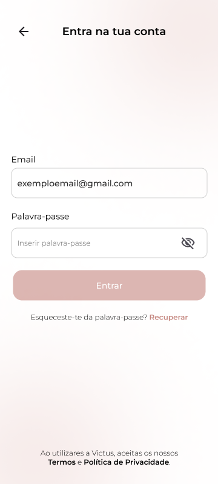
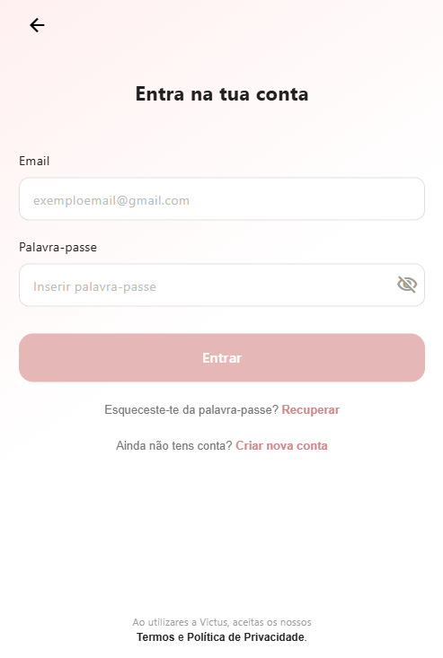
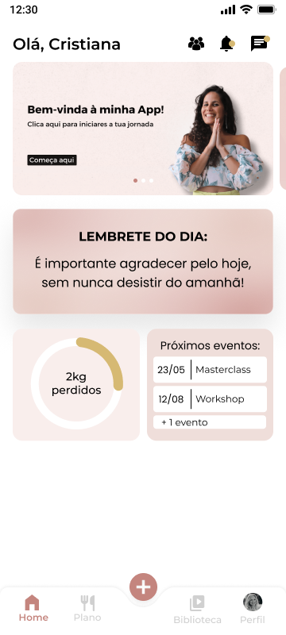
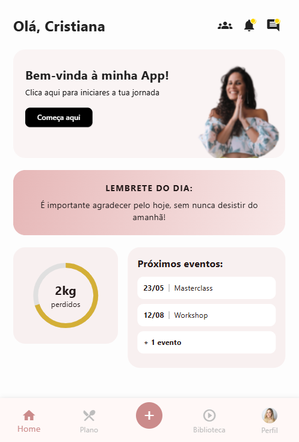
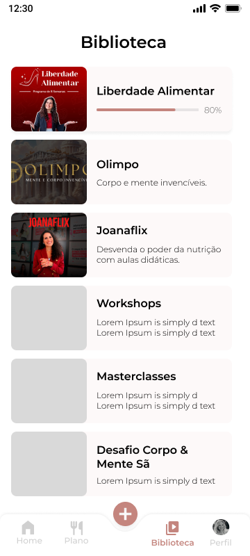
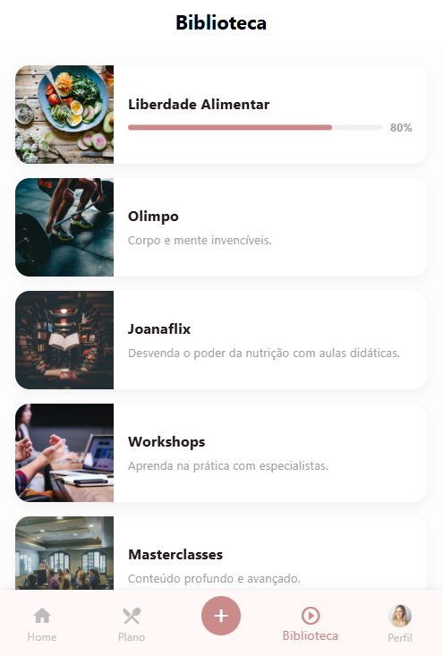
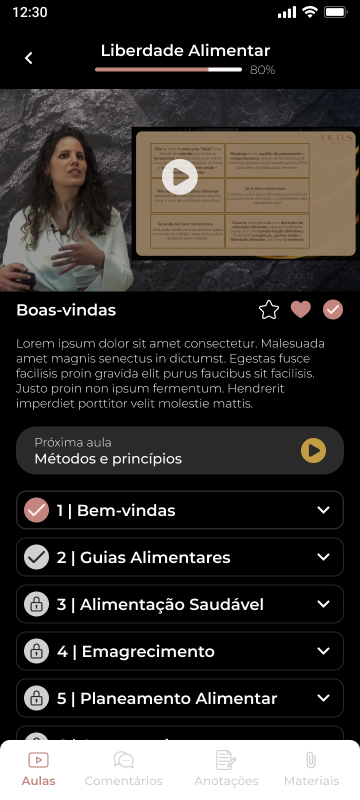
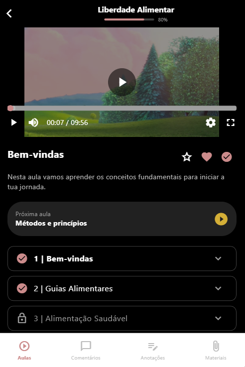
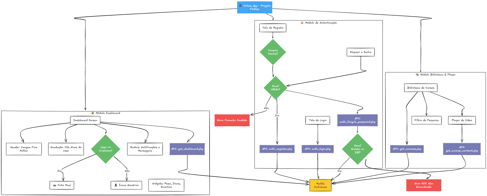

# 🏋️‍♀️ Victus App

Aplicação móvel de **fitness e nutrição**, desenvolvida em **Flutter** com backend em **PHP nativo**.
O projeto foca na experiência do utilizador, autenticação segura e consumo dinâmico de dados, seguindo rigorosamente o design system proposto.

---

## ⚙️ Instruções de Setup (Passo a Passo)

### 1. Configuração do Backend (API & Base de Dados)

1.  Certifique-se de ter um servidor local (ex: **XAMPP**, MAMP ou Docker) com PHP e MySQL.
2.  Coloque a pasta do projeto dentro do diretório público do servidor (ex: `C:\xampp\htdocs\victus_app`).
3.  Inicie o **Apache** e o **MySQL**.
4.  Aceda ao seu gestor de base de dados (ex: phpMyAdmin):
    * Crie uma base de dados chamada: `victus_db`
    * Importe o ficheiro SQL localizado em: `/api/db/schema.sql` (contém a estrutura e dados iniciais).
5.  Configure as credenciais de conexão em `/api/config/database.php` se necessário (Padrão configurado: root/sem senha).

### 2. Configuração do Frontend (App)

1.  Certifique-se de ter o **Flutter SDK** instalado e configurado.
2.  Abra o terminal na pasta `/app`.
3.  Instale as dependências:
    ```bash
    flutter pub get
    ```
4.  Execute a aplicação:
    ```bash
    flutter run
    ```
    *Nota: Se utilizar o emulador Android, verifique o `baseUrl` em `lib/core/api_client.dart` (padrão configurado para web/local: localhost).*

---

## 🧪 Credenciais de Teste

Para testar rapidamente sem criar conta:

* **Email:** `cristiana@victus.pt`
* **Password:** `123456`

*(Também pode utilizar a opção "Criar nova conta" na tela de login para gerar um novo utilizador).*

---

## 📸 Design vs. Implementação (Fidelidade Visual)

Um dos focos principais deste projeto foi a fidelidade ao Design System proposto. Abaixo apresento a comparação entre o protótipo (Figma) e o resultado final em código (Flutter):

| Tela | Design Proposto (Figma) | Resultado Final (App) |
| :---: | :---: | :---: |
| **Login** |  |  |
| **Dashboard** |  |  |
| **Biblioteca** |  |  |
| **Player** |  |  |

*(Nota: As imagens da direita representam a aplicação a correr em tempo real, consumindo dados da API)*

---

## 🚀 Diferenciais e Dinamismo (Deep Dive)

Neste projeto, nada foi deixado ao acaso. Cada tela possui lógica de estado (`State Management`) e integração com a API para garantir uma experiência fluida. Abaixo descrevo **tudo o que foi tornado dinâmico**:

### 1. 🏠 Dashboard (Painel Principal)
A tela mais complexa da aplicação, onde a personalização acontece em tempo real:

* **Saudação Personalizada:** O "Olá, [Nome]" não é estático. O nome é recuperado da sessão de Login (`ApiClient`) e exibido dinamicamente.
* **Avatar Inteligente (Lógica Condicional):**
    * Implementação de uma regra de negócio visual: Se o utilizador logado for a persona *"Cristiana"*, a barra de navegação inferior exibe a sua foto real.
    * Para qualquer outro utilizador (ex: *"Matheus"*), o sistema renderiza automaticamente um **ícone genérico** com fundo cinza.
* **Dados da API (`get_dashboard.php`):**
    * **Dica do Dia:** O texto no card degradê vem da base de dados.
    * **Progresso de Peso:** O gráfico circular e o valor ("-2kg") são injetados via JSON.
    * **Lista de Eventos:** Os eventos ("Consulta", "Aula de Yoga") são mapeados de uma lista dinâmica. Se a lista estiver vazia, a UI adapta-se.
* **Ícones de Topo Interativos:**
    * Os ícones de **Notificação** e **Mensagens** possuem indicadores de estado (bolinha amarela).
    * Ao clicar, abrem **Modais (Dialogs)** interativos que simulam conteúdo real (mensagens da nutricionista e alertas de sistema), em vez de apenas botões mortos.
* **Menu "Adicionar" (FAB):** O botão central da barra inferior abre um *Modal Bottom Sheet* com opções rápidas (Água, Refeição, Peso).

### 2. 📚 Biblioteca de Cursos
* **Consumo de API (`get_courses.php`):** A lista de cursos não é fixa (hardcoded). Ela é construída através de um `ListView.builder` baseado na resposta do servidor.
* **Pesquisa em Tempo Real:** A barra de pesquisa filtra a lista de cursos localmente à medida que o utilizador digita, atualizando a UI instantaneamente (`setState`).
* **Tratamento de Erros:** Exibição de *Loading Spinners* enquanto os dados carregam e mensagens de "Sem resultados" caso a pesquisa não encontre nada.
* **Navegação Persistente:** A barra inferior mantém a lógica do Avatar Inteligente também nesta tela.

### 3. ▶️ Player de Vídeo
A tela com maior complexidade de interação do utilizador:

* **Carregamento de Conteúdo (`get_course_content.php`):** O vídeo, título e descrição vêm do ID do curso selecionado anteriormente.
* **Player Robusto (Chewie + VideoPlayer):**
    * Inicialização assíncrona do vídeo.
    * Gestão de memória: O controlador antigo é descartado (`dispose`) antes de carregar um novo vídeo ao trocar de aula.
* **Lista de Aulas (Playlist):**
    * **Destaque Atual:** A aula que está a ser assistida fica a negrito e com cor branca.
    * **Bloqueio de Conteúdo:** Aulas marcadas como `is_locked` na BD exibem um cadeado e não são clicáveis.
    * **Status de Conclusão:** Aulas finalizadas mostram um ícone de "Check".
* **Interatividade Instantânea (Botões de Ação):**
    * **Favoritar (Coração), Avaliar (Estrela) e Concluir (Check):** Estes botões funcionam com `setState`, permitindo que o utilizador clique e veja o ícone preencher/ativar instantaneamente (feedback visual tátil).
* **Sistema de Abas (Tabs):** Navegação interna entre "Aulas", "Comentários" e "Materiais" altera o conteúdo abaixo do vídeo dinamicamente.

### 4. 🔐 Autenticação e Segurança
* **Validação de Formulários:**
    * Impossível submeter formulários vazios.
    * **Regex de Email:** O campo de email valida o formato (ex: exige `@` e `.`) tanto no Registo como na Recuperação de Senha.
* **Verificação de Existência (Server-side):**
    * Na recuperação de senha, o sistema consulta a BD (`auth_forgot_password.php`). Se o email não existir, retorna um erro específico (404) que é mostrado ao utilizador num `SnackBar` vermelho.
    * No registo, impede a criação de contas duplicadas.

---

## 🎯 O Desafio (Requisitos)

O objetivo deste projeto foi desenvolver uma aplicação Full-Stack funcional que cobrisse os seguintes requisitos fundamentais:

1.  **Backend (API):** Criar uma API REST em PHP (sem frameworks) para gerir utilizadores e conteúdos.
2.  **Autenticação:** Implementar Login e Registo persistentes.
3.  **Dashboard:** Criar um ecrã principal que consuma dados do utilizador (Peso, Dicas, Eventos).
4.  **Biblioteca:** Listar cursos/treinos vindos da base de dados.
5.  **Player:** Implementar uma interface de reprodução de vídeo para as aulas.

---

## 📂 Estrutura do Projeto

A solução está organizada em dois diretórios principais, separando claramente as responsabilidades entre frontend e backend:

```text
victus_app/
├── api/                  # Backend (PHP Nativo + SQL)
│   ├── config/           # Configuração da Base de Dados
│   ├── db/               # Script SQL (Schema + Seeds)
│   ├── models/           # Classes de dados (User, Library, etc.)
│   ├── utils/            # Utilitários (ex: Gerador de JWT)
│   └── *.php             # Endpoints da API REST
│
├── app/                  # Frontend (Flutter Mobile/Web)
│   ├── lib/
│   │   ├── core/         # Configurações globais (ApiClient)
│   │   ├── data/         # Repositórios e Modelos
│   │   └── ui/           # Telas e Widgets (Login, Dashboard, etc.)
│   └── pubspec.yaml      # Dependências do projeto
│
└── README.md             # Documentação do projeto
```

---

## 📱 Funcionalidades Principais

* **Autenticação Completa:** Login, Registo de Nova Conta e Interface de Recuperação de Password.
* **Dashboard Dinâmico:** Exibe o nome do utilizador, dicas de saúde diárias, progresso de peso e próximos eventos, tudo alimentado pela API em tempo real.
* **Biblioteca de Treinos:** Listagem de cursos via API com navegação integrada e tratamento de estados (loading/vazio).
* **Player de Vídeo:** Reprodução de aulas com interface personalizada.
* **Segurança:** Sistema de autenticação via **JWT (JSON Web Token)** implementado manualmente.

---

## 🛠️ Tecnologias Utilizadas

* **Frontend:** Flutter (Dart)
* **Backend:** PHP (Vanilla/Nativo) - Sem frameworks
* **Base de Dados:** MySQL / MariaDB
* **Comunicação:** REST API (JSON)
* **HTTP Client:** Dio

---


## 🏗️ Decisões de Arquitetura & Notas Técnicas

Para este projeto, foram tomadas as seguintes decisões técnicas focadas na entrega de valor, funcionalidade robusta e cumprimento dos requisitos:

* **HTTP Client (Dio):** Utilizado para todas as requisições, com implementação de *Interceptors* para injetar automaticamente o Token JWT nos cabeçalhos de autorização.
* **Gestão de Estado:** Optou-se pelo uso nativo de `setState` e `StatefulWidgets`.
* **Segurança PHP:** Implementação de headers CORS no backend para permitir o funcionamento correto em ambientes de desenvolvimento (Flutter Web/Localhost).

### 🔮 Melhorias Futuras (Roadmap)

Com o objetivo de evoluir o projeto para um ambiente de produção em larga escala, os próximos passos planeados seriam:

1.  **Arquitetura & Estado:** Migração completa para **Riverpod** ou **BLoC** e implementação estrita de **Clean Architecture**.
2.  **Testes Automatizados:** Implementação de testes unitários (backend e lógica Dart) e testes de integração (Frontend).
3.  **Funcionalidades Avançadas:**
    * Cache local de dados (Offline-first).
    * Upload de foto de perfil real.
    * Notificações Push (Firebase).
4.  **Backend:** Migração para um framework PHP robusto (ex: Laravel ou Symfony) para maior segurança e facilidade de manutenção.

---

## 🏗️ Arquitetura e Fluxo de Dados

O diagrama abaixo ilustra a comunicação entre a aplicação Flutter, a API em PHP e a Base de Dados, bem como as regras de negócio implementadas (validações e lógica de avatar).



---

## 👨‍💻 Conclusão

Projeto desenvolvido por **Izabela** como resposta ao desafio técnico proposto pela **Victus Clinica**.

---